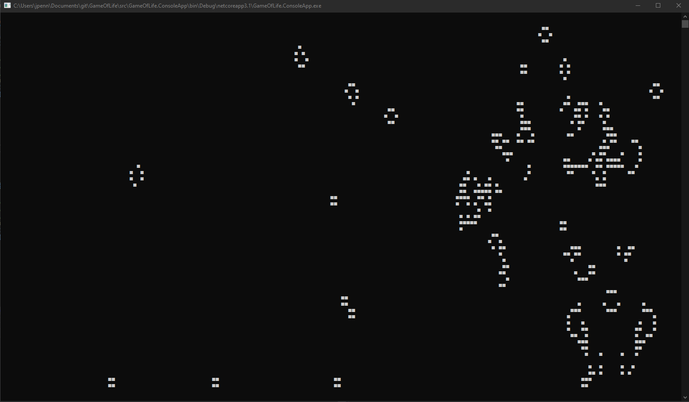

# Game of Life

This is my concept of Conway's game of life.

The world is generated by randomly placing some lifeforms on start, then adding some extra random noise.

[Examples of lifeforms on wikipedia](https://en.wikipedia.org/wiki/Conway's_Game_of_Life#Examples_of_patterns)

## Rules

- Any live cell with fewer than two live neighbours dies, as if by underpopulation.
- Any live cell with two or three live neighbours lives on to the next generation.
- Any live cell with more than three live neighbours dies, as if by overpopulation.
- Any dead cell with exactly three live neighbours becomes a live cell, as if by reproduction.

